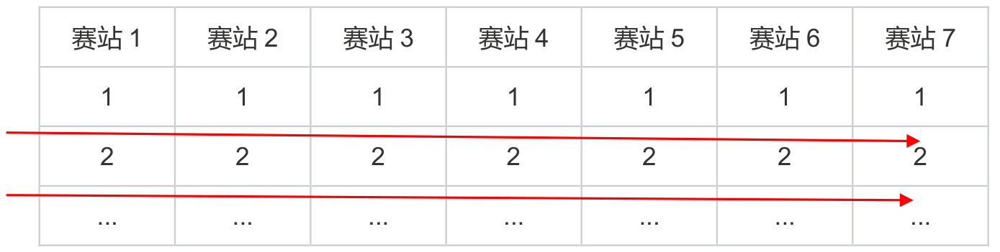

# Slot Allocation Plan for The 2026 ICPC Asia East Continent Final (EC Final)

> [Original Chinese version](https://icpc.pku.edu.cn/tzgg/109d767bb4464b24a5aa18563b65238e.htm)

In accordance with ICPC rules and the requirements of the Asia Regional Contests, the Organizing Committee of **The 2026 ICPC Asia East Continent Final (hereinafter referred to as "The 2026 EC Final")** has established the following slot allocation plan.

## I. Total Onsite Slots for The 2026 EC Final

The venue provides **300 workstations** and will allocate **280 official participation slots**, distributed across the following three categories:

1. **Qualification slots** extracted from the various Asia East Continent regional contest sites based on team rankings.  
   → Total: **240 slots**.

2. **"Contribution Bonus Slots"** recommended by the ICPC Asia East Continent Committee, which include:
   - Bonus slots for universities that advanced to the World Finals in the past three years (2023–2025), and
   - Bonus slots for host universities and problem‑setting universities of this year's EC regional contests.  
   → Total: **within 40 slots**.

3. **"Incentive Slots"** recommended under the ICPC Asia East Continent Committee's development program.  
   → Total: **within 10 slots**.

## II. Slot Allocation Scheme for The 2026 EC Final

The allocation of EC Final slots is conducted in **two rounds**.  
- **Mainland regional sites** receive **230 slots** through the **first round**.  
- **Hong Kong regional site** receives **10 slots** through the **second round**.

### 1. First Round Allocation

- Universities receiving **Contribution Bonus Slots** may apply for up to **4 slots** in the 2026 EC Final.
- Universities applying for **Incentive Slots** may apply for up to **1 slot**.
- Other universities are generally capped at **up to 3 slots**.

The detailed allocation is as follows:

#### (1) Mainland Regional Qualification Slots – 230 slots

These slots are allocated to teams qualifying from the mainland regional sites of ICPC Asia EC.  
Each university may qualify **at most 3 teams**, and it is the qualified teams that will participate in The 2026 EC Final.

First, all eligible teams (official participating teams that solved at least one problem) are arranged by regional site in descending order of the number of such teams:

Selection is performed **site‑by‑site in order**: first, take the 1st‑ranked team from each site; then take the 2nd‑ranked team from each site; and so on, until **230 teams** have been selected.

**Important constraints:**
- The **same team cannot be selected twice** (i.e., a team that qualifies through one site will not be counted again from another site).
- Once a university has reached its cap of **3 selected teams**, that university is **excluded** from further selections in this process.

#### (2) Contribution Bonus Slots – within 40 slots

These are recommended by the ICPC Asia East Continent Committee and consist of:
- **(i)** **1 slot** for each university that participated in the World Finals in **2023, 2024, or 2025**.
- **(ii)** **1 slot** for each host university and each problem‑setting university of the **2026 ICPC Asia EC Regional Contests**.

The participating teams for these Contribution Bonus Slots are **determined by the universities themselves** (i.e., they may choose which team to send).

#### (3) Incentive Slots (Remaining slots after the above)

Any slots not used after the allocations in (1) and (2) above will be repurposed as **"Incentive Slots"** under the ICPC Asia East Continent Committee's development program.

These slots are open to **universities that have not yet received any slot from (1) or (2)**. Interested universities may apply directly.  
The 2026 EC Final Organizing Committee will review and allocate these slots based on the university's performance across the Asia EC regional sites and other relevant considerations.

Each university may receive **at most 1 Incentive Slot**, and the participating team is **determined by the university itself**.

### 2. Second Round Allocation – 10 Slots from the Hong Kong Site

**(1)** Before the Hong Kong regional contest takes place, the **first round of EC Final registration** for mainland regional sites will already have been completed. In this document, the **"First‑Round Registration List"** refers to the list of universities, teams, and team members that have completed registration in that first round.

**(2)** The Hong Kong site may award **up to 10 EC Final registration qualifications**.  
The candidate pool is strictly limited to teams that win **gold, silver, or bronze medals** in the official Hong Kong contest, and qualifications are awarded in **descending order of final contest ranking** (from highest rank to lowest).  
When examining candidates in that order, if **any member of a candidate team already appears on the First‑Round Registration List**, that team is **skipped**, and the verification proceeds to the next ranked team.

**(3)** If a university already has **X** teams on the First‑Round Registration List, then that university may obtain **at most (3 − X)** additional qualifications via the Hong Kong site for regular universities, or **(4 − X)** for universities that have received bonus slot allocations.  
After traversing all candidate teams, if fewer than 10 eligible teams are found, the final number of qualifications shall be the actual count of eligible teams.

**(4)** What teams obtain through the Hong Kong site is the **right to register** for EC Final (i.e., the qualification to sign up). If a qualified team fails to complete registration within the prescribed deadline or voluntarily withdraws, that qualification becomes **void** and **will not be passed down** to any subsequent team.

**Illustration of the EC Final Qualification Selection Process (Restricted to Gold/Silver/Bronze Medal Teams)**

| Hong Kong Site Rank | 1st | 2nd | 3rd | 4th | 5th | ... |
| :--- | :--- | :--- | :--- | :--- | :--- | :--- |
| **Verification Result** | Eligible | Member duplicates First‑Round List | Eligible | University has reached its cap (3 or 4) | Eligible | Continue checking... |
| **Outcome** | ✅ Qualifies | ❌ Skipped | ✅ Qualifies | ❌ Skipped | ✅ Qualifies | → Move to next |

**Procedure**: Teams are verified in order from highest rank to lowest. Ineligible teams are skipped. The process continues until **10 qualifications** have been awarded or all candidate teams have been examined.

### Reallocation of All Remaining Slots

Any slots still unused after the above allocations will be opened for reallocation. Interested universities may apply, and the **2026 EC Final Organizing Committee** will review the applications.  
**In principle, priority will be given to universities that received fewer slots in the first allocation.**

## III. Final Provisions

The interpretation of this plan and any matters not explicitly covered herein rests with the **Organizing Committee of The 2026 ICPC Asia East Continent Final**.

**Issued by:**  
Organizing Committee of The 2026 ICPC Asia East Continent Final  
**Date:** September 3, 2026
