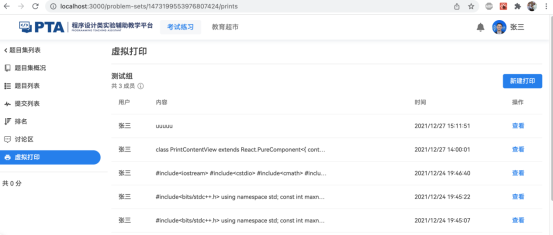
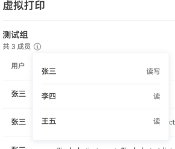
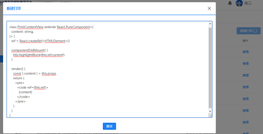
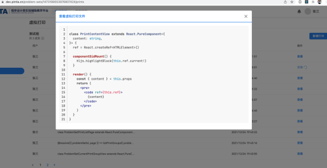
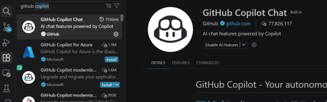

# Online Qualification Contest Handbook

> [Original Chinese version](https://icpc.pku.edu.cn/docs/2026-08/77ea6405152140158e9730cac73e04ed.pdf)

## I. Pre‑Competition Preparations

1. **Coach briefing**  
   Coaches must thoroughly explain all contents of this handbook to their team members, remind them of key procedures and precautions, prohibit any form of cheating, and ensure fair and honest participation.

   **Special Note on Programming Languages & AI Tools**  
   - Allowed languages: C++, C, Java, and Python 3.  
   - Local IDEs are permitted, but **any AI‑related features or plugins are strictly prohibited** (including plugins that use local large language models).  
   - Please **completely disable all AI functionalities and uninstall all AI plugins** before the contest. Failure to do so may result in disqualification, even if the tools are not actively used during the contest.

2. **Environment testing**  
   Complete hardware and software environment tests according to the technical requirements. If you encounter technical issues during testing, ask for help in the QQ group *"ICPC Asia EC Coach Group"*. Note that technical support will **stop 1 hour before the official contest begins**.

3. **Personal setup & OMS self‑check**  
   - Prepare your own machine and environment. Ensure that **no one is within a 2‑meter radius** around you during the contest.  
   - Complete the local test procedure following the [*OMS User Self‑Check Process*](https://oms.pintia.cn/download-oms-client?tab=self-check). For guidance, refer to the tutorial videos [*"How to Master the OMS Proctoring System"*](https://www.bilibili.com/video/BV1cV41167iS/) and [*"OMS Pitfall Avoidance Guide"*](https://www.bilibili.com/video/BV1Aq4y1m72G/).  
   - **Important**: Install and test the latest version of the OMS client *before* the contest. Issues discovered right before the contest may not receive a timely response.

4. **Hardware setup requirements**  
   1) **Team seating** – It is recommended that all teams be centrally located in their own school computer labs, with **at least 3 meters** of distance between different teams. Teams placed too close to each other may be unable to compete.
   
   2) **Workstations per member** – Each team member must use **one separate computer** to log into the system. Each computer may connect to **only one monitor, one keyboard, and one mouse**. Ensure a stable network connection and install both the proctoring environment and the required IDEs.  
      **Important**: Clear the project/file list of your competition machine before the start. Do **not** open any existing code to avoid unnecessary issues.

   3) **Dual‑camera setup** – Each team member must configure **two cameras**:
      - **Front camera**: positioned to clearly capture the participant’s face.
      - **Rear camera**: a **mobile phone** placed at the rear, slightly to the side, and positioned high enough to capture a wide angle.  
        - The **team leader’s phone** must be able to simultaneously capture **all 3 team members** and the entire desktop environment.  
        - Every participant’s **hands must remain visible in at least one camera at all times**.  
        - The **screen of every computer** used must appear in at least one of the rear cameras.

   4) **Network redundancy** – Test the network speed in your lab, taking into account the high bandwidth usage from multiple video streams. It is strongly advised to prepare a backup connection (e.g., a mobile hotspot).

   5) **Virtual Print feature** – No physical printer is needed.  
      - Virtual Print allows code sharing among team members: the **team leader** creates a print job on their own machine, and other members can view the printed document on their own screens.  
      - To use it: enter the contest problem set, click *"Virtual Print"* in the left sidebar.

      
      
      Click the icon next to the team name to check member permissions.

      

      Click the *"New Print"* button in the upper‑right corner, enter text in the pop‑up field, and click *"Submit"*.

      

      Once a print is successfully created, all team members can see and view the record in the print list.  
      
      ⚠️ **Critical restriction**: Only the **team leader’s host machine** may be used for writing, debugging, and submitting code. The other members’ machines are **only for viewing the problems, virtual print content, and the scoreboard**. Any other action on those machines will be treated as cheating.

      

5. **On‑site staff**  
   Arrange at least one official school faculty member or volunteer to oversee the venue and handle emergencies. They are allowed to enter the camera monitoring area to manage urgent matters.

6. **Login information verification**  
   When logging in via the mobile app, you will be asked for your **exam number** and **name**. **Double‑check that you do not swap these two fields.**

## II. Official Contest

1. **Schedule**  
   There are **two contests**:
   - Session 1: **September 6, 2026, 13:00 – 18:00 (5 hours)**
   - Session 2: **September 12, 2026, 13:00 – 18:00 (5 hours)**  
   Please complete all hardware and software preparations **30 minutes before** the start.

2. **Login procedure**  
   - The OMS proctoring system will start accepting login requests **1 hour before** the contest.  
   - **No pre‑approval is required** for login this year. Participants are **not required** to submit environment videos or selfie photos during login. Identity verification will take place **after the contest starts**.  
   - However, participants **must not leave early** before their identity is checked, otherwise their results may be invalidated.  
   - After logging in, **do not perform any other operations** – wait for the proctor to verify your documents.  
   - From login until the contest starts, **do not touch your mouse or keyboard**.

3. **Late login cutoff** – Any participant who has not logged in by **13:15** will be **unable to log in** for that session.

4. **Identity verification**  
   After login and during the contest, the proctor will pop up windows one by one requiring participants to show their student ID or other credentials. Please **keep an eye on pop‑up notifications** from the proctor. If necessary, the proctor will make a voice call via the mini‑program – set your phone volume to maximum and respond promptly when notified.

5. **Toilet breaks**  
   - When a participant needs to go, the on‑site supervisor/volunteer must **report in the WeChat group**: *"[School name] Team [member name] is going to the toilet"*.  
   - No explicit permission from the proctor is required; the participant may go on their own. **No camera follow‑up** is needed.  
   - The break must **not exceed 10 minutes**. Upon return, the supervisor must report: *"[School name] Team [member name] has returned"*.  
   - **Only 1 participant** from the same school may use the toilet at the same time.

6. **In‑contest questions about problems**  
   If you find an issue with a problem statement, you may raise it in the discussion area. If the statement is updated, a **uniform pop‑up notification** will be sent to all teams.

7. **Failure / incident handling**  
   1) **Individual device failure** – If a single member’s equipment fails, a volunteer may assist while on a video call with the proctor to show the handling process. If no volunteer is available, the other two team members’ cameras must capture the entire repair process, ensuring the *"I can always see you"* principle.
   
   2) **Power or network outage** – The coach or volunteer may use WeChat video to contact the proctor, ensuring the proctor can continuously see the affected team. The on‑site supervisor must instruct all students to **remain seated** while the issue is resolved. **No extra time** will be added to the contest.
   
   3) **Platform technical failures** – Solutions will be announced in the QQ group *"ICPC Asia EC Coach Group"*, and the on‑site supervisor must inform the students.

## III. Post‑Contest Procedures

1. **Results & plagiarism check**  
   Within **168 hours (7 days)** after the contest, the technical team will complete:
   - Code similarity checks (plagiarism detection)
   - Screen recording reviews  
   After all cheating cases are processed, the official results will be released by the Organizing Committee.

2. **Appeals**  
   - If you disagree with the results, you may request a review.  
   - Appeals must be **real‑name** and submitted with:
     - Signatures from the team coach and all 3 team members
     - An official stamp from the school or college  
   - Appeals must be sent to the Organizing Committee, which will issue a formal written response.

> **Rights of interpretation**  
> The right to interpret the above requirements rests with the **ICPC Asia EC Competition and Organizing Committee**. Any details not covered herein will be supplemented by separate committee notices.

**Issued by:** ICPC Asia EC Competition and Organizing Committee  
**Date:** August 27, 2026

## Appendix 1: Key Competition Reminders

This contest uses a **dual‑camera** login system. You must complete the following steps to enter the contest interface:

1. **Self‑test**: Complete the self‑check at https://oms.pintia.cn/download-oms-client?tab=self-check according to the requirements.  
   *Think of this as:* `while (self_test == fail) { test(); }` – thank you. Any problems caused by **skipping the self‑test** will be your own responsibility.

2. Obtain your **exam number** and **contest code** from your school coach before the contest.

3. **Login**: The OMS system opens login **1 hour before** the contest. After submitting the login request, you will be automatically logged in. Once logged in, **do not operate anything** – wait for the proctor’s identity verification.

4. From login until the contest begins, **do not touch your mouse or keyboard**. Just wait for the start.

### Common Issues & Solutions

#### 1. No contest code
- **Fix**: Contact your school coach. Only coaches are added to the proctoring group this year. Team members should report issues to their coach first.

#### 2. Mini‑program says "Participant does not exist"
- **Fix**: 
  - Double‑check that the exam number matches what your coach provided.
  - Confirm that you have **not swapped** the Exam Number and Name fields.

#### 3. Approval passed, but the OMS client does not respond
- **Fix**: **Do not close the OMS client** after submitting the login request.  
  - The client generates a **new QR code every time it starts** – if the QR code you photographed differs from the one currently displayed on the client, login will fail. You will have to take a new photo and re‑submit your request.

#### 4. OMS client logs in but then crashes (flash‑quit)
- **Fix**: Check and enable **microphone permissions** on your computer.  
  - If the issue persists, switch to another machine.  
  - This type of problem can be detected and resolved during the **self‑test**. If it happens during the contest, it means you skipped the self‑test, and you bear the consequences.

#### 5. First‑camera window is black
- **Fix**: This is often caused by antivirus software (e.g., Huorong) blocking camera access – disable the antivirus protection over the camera, or close the antivirus entirely.  
  - **All operations must be performed in full view of the second (phone) camera**.  
  - If that fails, you must **switch machines**. The standard procedure is:
    1. The proctor will notify the team via pop‑up or direct call, and request a video call from the coach in the proctoring group to show the affected team.
    2. With the proctor’s permission, turn off the faulty machine **in front of the second camera**, switch to a new machine, and start the OMS client.
    3. Close the mini‑program on the phone, take a new photo, and re‑submit the login request.

#### 6. Second camera (phone) goes dark
- **Fix**: It is **very important** to let the phone appear in the first camera’s view – the system records the entire process, proving that no one secretly turned off the second camera to assist in cheating.
  - **Standard procedure**:
    1. When the proctor pops up a warning to turn on the second camera, **acknowledge it immediately (within 2 seconds)**.
    2. Move your mouse to the **bottom‑right corner of the OMS client** – hovering there will display a QR code.
    3. On the phone mini‑program, tap the top‑left corner to return to the main screen, select *"Reconnect"*, and scan the QR code to restore the feed.
    4. If repeated attempts fail, write *"Re‑login"* on paper, hold it in front of the first camera for the proctor to see, and call your coach. The coach must contact the proctor in the proctoring group and start a video call showing the problematic team. The team may then restart the mini‑program, restart the OMS client, and re‑submit the login application.
  - **Friendly reminder**: 
    - Keep your phone plugged into a charger.
    - If your phone overheats easily and shuts down, have a spare phone ready.
    - If you have no intention of cheating, **perform all phone operations in front of the first camera** – this leaves a clear record of your integrity.

## Appendix 2: How to Disable AI Features in Common Programming Tools

### Visual Studio Code

You can disable built‑in AI features in VS Code by adding the following line to your `settings.json` file:

```json
"chat.disableAIFeatures": true
```

Alternatively, click **Disable** in the relevant settings interface:



In addition to GitHub Copilot, **please uninstall any other AI‑related plugins** (e.g., Claude Code, CodeX, DSH, etc.).

### JetBrains IDEs (IntelliJ, CLion, PyCharm, etc.)

Uninstall the corresponding AI plugins, for example:

- Full Line Code Completion
  https://plugins.jetbrains.com/plugin/14823-full-line-code-completion

⚠️ **Important**: You must check **every plugin you have installed (including built‑in ones)**. If any AI plugin is discovered during proctoring monitoring or during the post‑contest screen‑recording review, **regardless of whether it was actually used**, it will be treated as cheating.